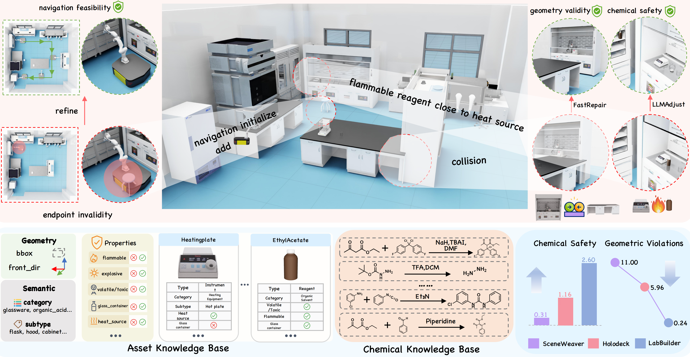
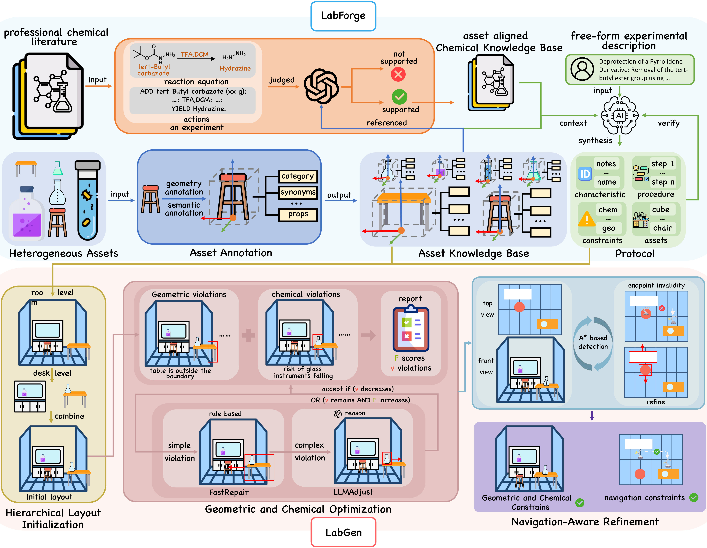

<p align="center">
  
</p>

<h1 align="center">LabBuilder: Protocol-Grounded 3D Layout Generation<br>for Interactable and Safe Laboratory</h1>

<p align="center">
  <a href="https://arxiv.org/pdf/2605.02288"></a>
  <a href="https://arxiv.org/abs/2605.02288"></a>
  <a href="https://che-0212.github.io/LabBuilder-site/"></a>
</p>

<p align="center">
  <b>ICML 2026</b>
</p>

---

## Overview

Given a free-form experimental description, **LabBuilder** generates end-to-end 3D laboratory layouts that are geometrically compliant, chemically safe, and robot-navigable. It operates through three tightly coupled components:

- **LabForge** — Curates a meta-dataset of annotated assets and chemical knowledge, translating natural language specifications into structured protocols.
- **LabGen** — Synthesizes laboratory layouts via hierarchical initialization, geometric & chemical optimization, and navigation-aware refinement.
- **LabTouchstone** — Evaluates layouts across geometric compliance, feasibility, chemical safety, and semantic plausibility.

<p align="center">
  
</p>

## Installation

```bash
git clone https://github.com/che-0212/LabBuilder.git
cd LabBuilder
pip install -r requirements.txt
```

### API Configuration

LabBuilder uses OpenAI-compatible LLM APIs. Configure your credentials:

```bash
cp .env.example .env
# Edit .env with your API key and base URL
```

Or set environment variables directly:
```bash
export OPENAI_API_KEY="your-api-key"
export OPENAI_BASE_URL="https://api.openai.com/v1"
```

### 3D Assets

Download the annotated 3D asset files (USD format):

```bash
# Download from [link to be added]
# Extract to assets/
```

The asset metadata (`data/assets_annotated.json`) is included in this repository and contains geometry, semantic, and chemical safety annotations for 176 laboratory assets.

## Release Status

| Module | Status | Description |
|--------|--------|-------------|
| **LabForge** | Released | Protocol synthesis from experimental descriptions |
| **LabGen** | Coming soon | Hierarchical layout generation & optimization |
| **LabTouchstone** | Coming soon | Four-dimensional evaluation benchmark |

## Code Structure

```
LabBuilder/
├── labforge/                    # LabForge: Protocol Synthesis
│   ├── protocol_planner.py      #   Main protocol generation pipeline
│   ├── protocol_prompt.py       #   Prompt templates for protocol synthesis
│   ├── protocol_schema.py       #   Data schemas (Protocol, Step, Asset, Constraint)
│   └── ragflow_client.py        #   RAG-based knowledge retrieval (optional)
│
├── labgen/                      # [Coming Soon] LabGen: Layout Generation & Optimization
│
├── labtouchstone/               # [Coming Soon] LabTouchstone: Evaluation Suite
│
├── data/                        # Data & Knowledge Base
│   ├── assets_annotated.json    #   Asset Knowledge Base (176 lab assets)
│   ├── experiments.json         #   30 experiment descriptions (benchmark)
│   ├── rag_knowledge_base/      #   RAG retrieval documents
│   └── examples/                #   Example protocols
│
├── scripts/                     # Entry Scripts
│   ├── run_planner.py           #   Single protocol generation
│   └── batch_generate_protocols_parallel.py
│
├── utils/                       # Shared Utilities
├── requirements.txt
├── .env.example
└── LICENSE
```

## Usage

### Protocol Synthesis (LabForge)

Generate a structured protocol from a natural language experiment description:

```bash
python scripts/run_planner.py "Boc Deprotection of Hydrazine using TFA in DCM"
```

### Batch Processing

```bash
# Generate protocols for all 30 experiments
python scripts/batch_generate_protocols_parallel.py \
    --experiments data/experiments.json \
    --output-dir output/protocols/
```

### Layout Generation & Evaluation (Coming Soon)

LabGen and LabTouchstone will be released soon. Stay tuned!

## Evaluation Metrics

LabTouchstone evaluates layouts across four dimensions:

| Dimension | Metrics | Description |
|-----------|---------|-------------|
| **Geometric Compliance** | Obj, OB, CN | Asset count, boundary violations, collisions |
| **Feasibility Success Rate** | Asset, Nav | Asset availability, navigation feasibility |
| **Chemical Safety** | Flam, Store, Incomp, Glass | Flammable isolation, storage, incompatibility |
| **Semantic Plausibility** | Real, Lay, Comp | Realism, layout rationality, completeness |

## Citation

If you find this work useful, please cite:

```bibtex
@article{cao2026labbuilder,
  title={LabBuilder: Protocol-Grounded 3D Layout Generation for Interactable and Safe Laboratory},
  author={Cao, Jianbao and Zhao, Zhangrui and Feng, Bohan and Hu, Zixuan and Li, Rui and Wan, Haiyuan and Li, Chenxi and Li, Jingyuan and Cai, Wenzhe and Bai, Lei and others},
  journal={arXiv preprint arXiv:2605.02288},
  year={2026}
}
```

## License

- **Code** — Released under the [MIT License](LICENSE).
- **Data Assets** — Released under the [CC BY-NC 4.0 License](https://creativecommons.org/licenses/by-nc/4.0/). Free to use for research and educational purposes only.

## Acknowledgements

This work was supported by Shanghai AI Laboratory, Wuhan University, Beihang University, Peking University, Tsinghua University, Shanghai Jiao Tong University, and The Chinese University of Hong Kong.
